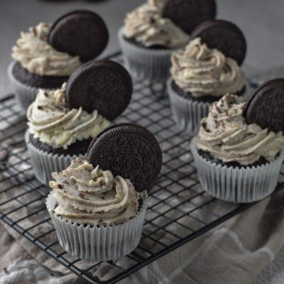
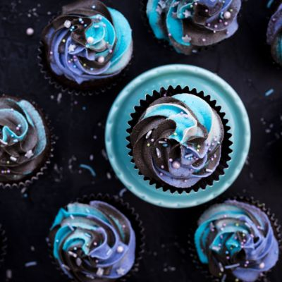
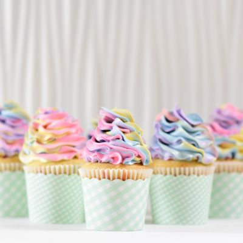
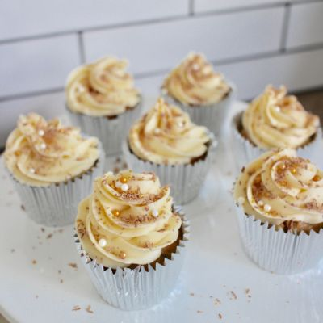
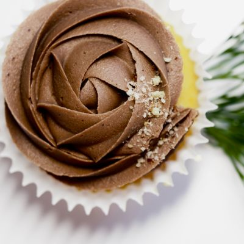
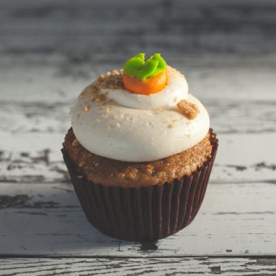

# Munamii Cakery Website
This website project was created during the Frontend Development module in Software Development Academy, iteration 9.

## Project Notes

This website project is to be made using HTML and CSS only. The client specifications are:

\- Must work on both mobile phones and desktop displays

\- Must have 4 pages: Home, About, Products, Contact

\- Product page must be divided into Cupcakes and Wedding Cakes

\- Must be at least 8 cupcakes and at least 8 wedding cakes

\- Each product must have a picture, title, and price

\- The header must have a link for each page

\- The footer must have links to Instagram, Facebook, and email

\- The footer must be the same across all pages

Optional tasks:

\- Include a contact form

\- Create a section in the Home page or within the footer for subscribing to an email list

Logo and use of Munamii photos is provided with permission

## Files & Directories

This project includes a 'public' folder for use with Firebase, containing the HTML files.

Within the 'public' folder are 'css' directory containing CSS files, 'fonts' directory containing two web font folders and 'images' directory containing website images.

The 'images' directory contains two subdirectories, 'cupcake' and 'weddingcake' which contain the cropped and resized product images. These directories each contain an 'originals' subdirectory containing the original unedited photos.

```
.public
├── css
├── fonts
│   ├── Opificio-regular-rounded
│   └── Quantum-artdesign
└── images 
    ├── cupcake
    │   └── originals
    └── weddingcake
        └── originals
```


## Design Notes
Edited the original logo, replacing free web fonts in place of the original fonts.

## Author
Fiona Thompson

Created between Mar 24-26 2021 for an assignment from Software Development Academy, iteration 9.
## Credits
Munamii Cakery for original logo and all photos not listed below.

### Photo credits:

Oreo cupcake photo by <a href="https://unsplash.com/@tasikola_pl?utm_source=unsplash&utm_medium=referral&utm_content=creditCopyText">Aleksandra Tanasiienko</a> on <a href="https://unsplash.com/@tasikola_pl?utm_source=unsplash&utm_medium=referral&utm_content=creditCopyText">Unsplash</a>



Galaxy cupcake photo by <a href="https://unsplash.com/@calavera?utm_source=unsplash&utm_medium=referral&utm_content=creditCopyText">David Calavera</a> on <a href="https://unsplash.com/@calavera?utm_source=unsplash&utm_medium=referral&utm_content=creditCopyText">Unsplash</a>



Rainbow cupcake photo by <a href="https://unsplash.com/@biglaughkitchen?utm_source=unsplash&utm_medium=referral&utm_content=creditCopyText">Deva Williamson</a> on <a href="https://unsplash.com/s/photos/cupcake?utm_source=unsplash&utm_medium=referral&utm_content=creditCopyText">Unsplash</a>



Butterscotch cupcake photo by <a href="https://unsplash.com/@oliviaht?utm_source=unsplash&utm_medium=referral&utm_content=creditCopyText">Olivia Herlambang-Tham</a> on <a href="https://unsplash.com/@oliviaht?utm_source=unsplash&utm_medium=referral&utm_content=creditCopyText">Unsplash</a>



Chocolate cupcake photo by <a href="https://stocksnap.io/author/jesswaters">Jess Watters</a> from <a href="https://stocksnap.io">StockSnap</a>



Carrot cupcake photo by <a href="https://stocksnap.io/author/39383">Joseph Gonzalez</a> from <a href="https://stocksnap.io">StockSnap</a>



### Miscellaneous Credits

Fonts found at ffonts.net

Quantum font credited to <a href="https://fontbundles.net/art-design">Art Design</a>

Opificio Regular Rounded credited to <a href="https://www.monofonts.com">MonoFonts.com</a>

MailChimp service used to create newsletter subscription and provided a customizable contact form linked to by the Contact page.